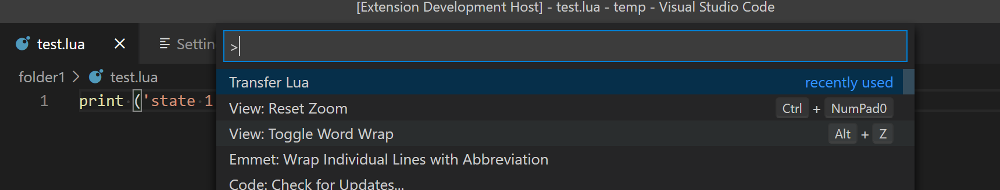

# VSCode TransferLua Extension

This extension adds a command to VSCode to transfer Lua scripts to [Indel AG](https://indel.ch) targets.

While eidting a Lua script, press F1 and select `Transfer Lua` as shown here:



This is a rather minimalistic extension at this time, but already allows to transfer arbitrary Lua scripts to configurable Lua states. There's also basic reporting about success or failure, although, in case of errors, the details needs to be gotten from the Indel Eventlog so far.

## License

MIT

## Project

This extension was developed independently of Indel. Thus, Indel should not be blamed for any issues you might have with this extension.

In fact, this is an open source project and everybody's invited to contribute. Including Indel employees.

## Features

- Download the content of the Lua script currently opened and active in the editor

## Requirements

In order to download the Lua script to the right Indel target and the right Lua state, the following pre-conditions must be fulfilled:

- Configure the Indel target name
- Workspace paths (folder) can (and must) be assigned to Lua states (see configuration example below)
- Lua scripts must be part of a workspace

Moreover, the IndelToolsSetup must be installed, providing the Indel TranfserLua-dynamic library.

## Extension Settings

Include if your extension adds any VS Code settings through the `contributes.configuration` extension point.

For example:

This extension contributes the following settings:

* `transferlua.indeltarget`: set to the name of the Indel target to which to transfer the Lua scripts to
* `transferlua.luastates`: configure the Lua states

A valid configuration may look like this:

```json
{
    "editor.renderWhitespace": "all",
    ...
    "transferlua.luastates": [
    
        {
            "path": "folder1",
            "state": "Machine"
        },
        {
            "path": "folder2",
            "state": "Machine"
        }
    ],
    "transferlua.indeltarget": "Net251"
}
```

## Known Issues

- Error/Problem reporting is quite poor (merely "success" or "failure" is shown as of today)
- Lua state mapping must be done by editing the VSCode configuration file "manually"

### 1.0.0

The initial release

### Authors

- Raphael Zulliger <zulliger@software-natives.io>
